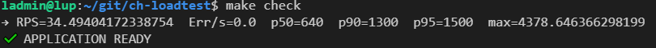
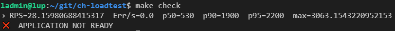

Author  
Andrey Chuyan (oksigen077777@gmail.com)  
Copyright 2025 Andrey Chuyan  

# 🚦 Locust Load Testing Toolkit


Locust Load Testing Toolkit — это удобный набор скриптов и Makefile для быстрого запуска нагрузочного тестирования любой веб-системы с помощью [Locust](https://locust.io/).  
Всё запускается в Docker — никаких плясок с питонами и пакетами на вашей машине!

---
⚡ Возможности

- 🐍 Тестирование через Locust — быстрое развертывание окружения и запуск сценариев без ручной сборки и конфигураций.
- 🕹️ Web UI — простой просмотр хода теста прямо в браузере (http://localhost:8089).
- 📈 Автоматическое сохранение отчетов — все метрики (CSV) сохраняются в отдельную папку.
- 🔬 Формализованная проверка готовности — скрипты автоматически определяют, прошла ли ваша система нагрузку по ключевым метрикам (RPS, ошибки, латентность и др).
- 🔄 Готовые профили нагрузочного тестирования:
  - Базовый сценарий
  - Ramp-up (плавное увеличение нагрузки)
  - Stress (нагрузка до предела)
  - Soak (продолжительная нагрузка)


---
🚀 Быстрый старт

1. Клонируем репозиторий:

```bash
git clone https://github.com/your-org/locust-load-test-toolkit.git
cd locust-load-test-toolkit
```

2. Создайте .env с нужными параметрами:

```ini
# .env
HOST=http://my-target.com
ENDPOINTS=/,/api/catalog/
ENDPOINTS_WEIGHTS=2,1
```

3. Отредактируйте test.env под параметры вашей инфраструктуры.

```ini
# .env
# --------- Пороги для проверки готовности приложения ------------
MIN_RPS         =50       # минимальный RPS (Requests Per Second (запросов в секунду))
MAX_ERRS        =1        # макс. число ошибок в секунду
MAX_P50         =500      # макс. 50-й перцентиль (мс)
MAX_P90         =900      # макс. 90-й перцентиль (мс)
MAX_P95         =1500     # макс. 95-й перцентиль (мс)
MAX_MAX         =2500     # макс. время ответа (мс)

# ------------ Базовый сценарий (base) ----------------------------
BASE_USERS      =100      # число одновременных пользователей (воркеров) в сценарии base
BASE_SPAWN_RATE =10       # скорость "запуска" новых пользователей в секунду (spawn rate), сценарий base
BASE_RUN_TIME   =1m       # общее время выполнения сценария (duration), формат: Xm/Xs
```

4. Установите зависимости:

```bash
sudo apt install docker make
```

5. Соберите образ

```bash
make build
```

6. Запустите тест в Web UI (откроется на http://localhost:8089):

```bash
make run-web
```

7. Запустите headless тест и сбор CSV-отчетов:

```bash
make test
# или любой сценарий ниже
make spectest-ramp-up
make spectest-stress
make spectest-soak
```

8. Проверьте готовность системы по результатам:

```bash
make check
```

Бот проверит значения метрик против заданных порогов.





--
👨‍💻 Структура Makefile / сценариев

- test — базовый нагрузочный тест (настройки через `test.env`)
- spectest-ramp-up — плавный рост нагрузки
- spectest-stress — стресс-тест
- spectest-soak — длительный soak-тест
- clean — удаление Docker-образа

Все параметры вынесены в `.env` и `test.env`  
Вы можете менять скорости, длительности и пороги без правки кода!

---
📝 Формат отчетов

- Все отчеты (CSV) сохраняются в папку `./reports`
- Формат метрик: RPS, количество ошибок, латентность (p50, p90, p95, max)
- Поддерживается валидация — автоматика проверяет, прошла ли система тест!

---
🛠️ Примечания

- Требования:  
  - Linux (Debian/Ubuntu)
  - Docker
  - Make

- Расширение сценариев:  
  Опишите свои endpoints и веса в `.env`. Для сложных сценариев — пишите свой `locustfile.py`.

- Изменение порогов:  
  Открывайте `test.env` — все лимиты по RPS, ошибкам и латентности редактируются в любой момент.

---
✨ Разработка/Контрибьютинг

- Любой PR или issue приветствуются!
- Проект развивается и открыт для предложений.

---
📬 Связь

Возникли вопросы или предложения?  
Пишите на почту oksigen077777@gmail.com или открывайте issue.

Telegram-канал: [@IT_Chuyana](https://t.me/IT_Chuyana)

---

> P.S.: Любите контролировать нагрузку, а не страдать — пользуйтесь автоматизацией! 🚀

---

Пример использования:

```bash
make spectest-stress HOST=https://myapi.com
make check
```


---

(c) 2025, Andrey Chuyan


